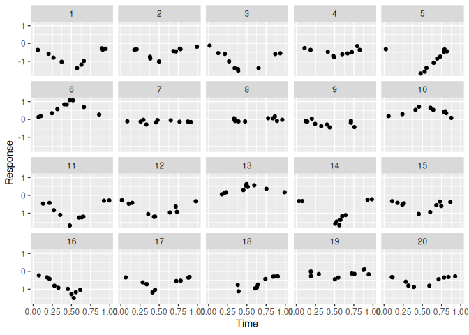
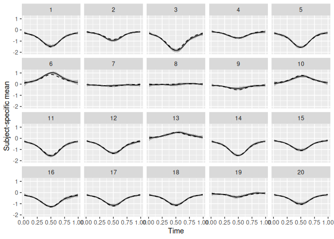

<!-- README.md is generated from README.Rmd. Please edit that file -->

# flexl

The goal of flexl is to implement flexible models for simple
longitudinal data. Given repeated observations on different subjects, we
model how the mean response for each subject varies over time.

Writing $Y_{ij}$ for the observation on subject $i$ at time point
$t_{ij}$, we model $Y_{ij} = \mu_i(t_{ij}) + \epsilon_{ij},$ where
$\mu_i(.)$ is a function describing how the mean response for subject
$i$ varies over time, and $\epsilon_{ij} \sim N(0, \sigma^2)$ are
independent error terms. Our interest is in estimating the
subject-specific mean functions $\mu_i(.)$. In doing this, we allow
flexible dependence on time, and make similarities between these curves
to improve estimation.

Details of the methods used by flexl are given in [this
preprint](https://arxiv.org/abs/2401.11827).

## Installation

flexl can be installed by using

``` r
devtools::install_github("heogden/flexl")
```

## Example

For demonstration purposes, we use some simulated longitudinal data,
with 20 subjects and 10 observations per subject

``` r
library(flexl)

data_full <- simulate_1dv(1, -0.5, 0.1, 0.5, 0.1, 20, 10)
data <- data_full$data
```

The data is in the format needed by flexl: it contains columns `c` (an
identifier for the subject), `x` (the time the observation was made) and
`y` (the response).

We can plot the data:

``` r
library(tidyverse)

ggplot(data, aes(x = x, y = y)) +
    geom_point() +
    facet_wrap(vars(c), ncol = 5) +
    xlab("Time") +
    ylab("Response")
```

 We
can then fit the model using flexl:

``` r
mod <- fit_flexl(data)
```

We can then plot out our estimated subject-specific mean curves, with
pointwise 95% confidence intervals. Since this is simulated data, we can
compare the fitted mean curves against the true mean curves.

``` r
pred_data <- data_full$pred_data %>%
    mutate(mu_c_hat = predict_flexl(mod,
                                    newdata = list(x = x, c = c),
                                    interval = TRUE))

ggplot(pred_data, aes(x = x)) +
    geom_line(aes(y = mu_c_hat$estimate)) +
    geom_ribbon(aes(ymin = mu_c_hat$lower, ymax = mu_c_hat$upper),
                alpha = 0.3) + 
    geom_line(aes(y = mu_c), linetype = "dashed") +
    facet_wrap(vars(c), ncol = 5) +
    xlab("Time") +
    ylab("Subject-specific mean")
```



In this simulated example, the fitted mean curves (solid lines) and the
true mean curves (dashed lines) match closely. The confidence intervals
are narrow in this case, but contain the true mean most of the time.
